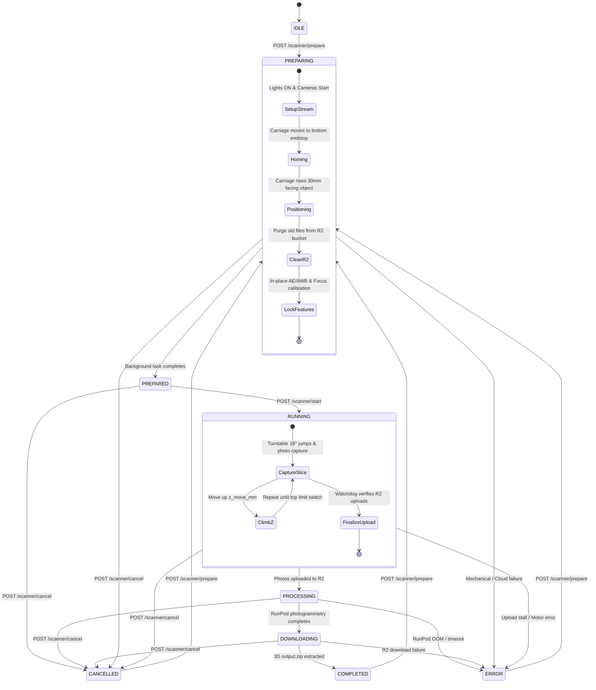

# Scanner Core API Documentation (`/scanner`)

The Scanner router (`../scanner.py`) orchestrates the end-to-end photogrammetry pipeline: camera stream initialization, mechanical positioning, 360° capture synchronization, cloud GPU 3D reconstruction, and mesh retrieval.

Interactive OpenAPI documentation is accessible at: `http://<pi-ip>:8000/docs#/Scanner`

---

## State Machine Architecture

The scanner operates as a strictly validated finite state machine (`ScannerState`):



---

## Endpoint Reference

| Method | Path | Status Code | Description |
|---|---|---|---|
| `POST` | `/scanner/prepare` | `202 Accepted` | Starts live stream immediately, homes carriage, and auto-tunes cameras in background |
| `POST` | `/scanner/start` | `202 Accepted` | Launches the physical scan, cloud Meshroom pod, and asset download pipeline |
| `POST` | `/scanner/cancel` | `200 OK` | Emergency stop: cuts motor power, kills lights, closes streams, terminates cloud pods |
| `GET` | `/scanner/status` | `200 OK` | Polls current state, total captured photos, and active stream URLs |

---

## 1. Prepare Scan (`POST /scanner/prepare`)

Prepares the scanner for framing and calibration. 

### Behavior
1. **Immediate Execution (~1.5s)**:
   - Validates that state is in `[IDLE, COMPLETED, CANCELLED, ERROR]`.
   - Transitions state to `PREPARING`.
   - Powers ON the chamber lights.
   - Initializes the dual cameras and boots the H.264 RTSP video encoder.
   - **Immediately returns HTTP 202** with RTSP stream URLs so the frontend video player can display the live feed right away.
2. **Background Execution**:
   - Drives the carriage down until the bottom limit switch triggers (`home_z_axis`).
   - Climbs **+30mm** above home to rest directly in front of the illuminated turntable object.
   - Cleans up old assets in the Cloudflare R2 bucket.
   - Re-runs camera auto-tuning (`prepare_scan`) in position: settles auto-exposure and auto-white-balance on the illuminated object, then locks them.
   - Transitions state to `PREPARED`.

### Request Body (`PrepareRequest`)
```json
{
  "enable_stream": true,
  "bitrate": 2000000,
  "camera_config": {
    "master_id": 0,
    "slave_id": 1,
    "quality": 95,
    "photo_resolution": [4056, 3040],
    "video_resolution": [1920, 1080],
    "preview_resolution": [1280, 720],
    "rotation": 0,
    "focus": null,
    "show_preview": false,
    "settle_time": 2.0,
    "exposure_time": null,
    "analogue_gain": null,
    "colour_gains": null,
    "awb_mode": "auto",
    "brightness": null,
    "contrast": null,
    "saturation": null,
    "sharpness": null,
    "autofocus_step": 30,
    "keep_running": false
  }
}
```

### Response (`202 Accepted` - `PrepareResponse`)
```json
{
  "status": "accepted",
  "message": "Live stream started. Rig homing and camera tuning in progress.",
  "state": "preparing",
  "stream_urls": [
    "rtsp://192.168.1.100:8554/cam0",
    "rtsp://192.168.1.100:8554/cam1"
  ]
}
```

### Error Responses
* `400 Bad Request`: If scanner is currently in an invalid state (e.g. `RUNNING` or `PROCESSING`).
* `500 Internal Server Error`: Hardware initialization failure.

### Example `curl`
```bash
curl -X POST http://localhost:8000/scanner/prepare \
     -H "Content-Type: application/json" \
     -d '{
       "enable_stream": true,
       "bitrate": 2000000,
       "camera_config": {
         "master_id": 0,
         "slave_id": 1
       }
     }'
```

---

## 2. Start Scan (`POST /scanner/start`)

Starts the automated scanning and cloud 3D generation workflow.

### Pre-conditions
* Scanner state **must** be `PREPARED` (obtained by polling `GET /scanner/status` after calling `/prepare`).

### Behavior
1. Validates `scanner.state == ScannerState.PREPARED`.
2. Returns HTTP `202 Accepted` immediately.
3. Dispatches the multi-stage background orchestrator:
   * **Stage 1 (Physical Scan & Upload - `RUNNING`)**:
     * Rotates turntable in incremental jumps (`angle`, default `18.0°` = 20 stops per 360° ring) using smooth trapezoidal velocity ramping (default 20% ramp) to eliminate inertia slip.
     * Synchronously captures photos from both cameras (2 photos per stop).
     * Pushes captured images into a background upload queue (uploads stream to Cloudflare R2 in parallel).
     * Climbs Z-axis by `z_move_mm` (default `100.0mm`) per elevation ring until the top limit switch triggers.
     * Stalled-upload watchdog guarantees all photos are securely stored in R2.
   * **Stage 2 (Cloud Meshroom Photogrammetry - `PROCESSING`)**:
     * Transitions state to `PROCESSING`.
     * Launches a cloud GPU pod on RunPod (e.g., RTX 4090 / RTX 5090).
     * Runs Meshroom pipeline: Feature Extraction (SIFT), Structure-from-Motion (SfM), DepthMap, Meshing, Texturing.
     * Automatically handles out-of-memory GPU fallbacks.
   * **Stage 3 (Asset Download - `DOWNLOADING`)**:
     * Transitions state to `DOWNLOADING`.
     * Downloads `output.zip` containing the completed `.obj`, `.mtl`, and texture files from Cloudflare R2.
     * Extracts files to the local output directory.
   * **Stage 4 (Completion - `COMPLETED`)**:
     * Transitions state to `COMPLETED`.

### Request Body (`StartRequest`)
```json
{
  "job_id": "scan-vase-001",
  "mechanical": {
    "angle": 18.0,
    "z_move_mm": 100.0,
    "turntable": {
      "delay": 0.0010,
      "acceleration": true,
      "ramp_percent": 0.2,
      "decel_percent": null,
      "start_delay": null
    },
    "z_axis": {
      "delay": 0.0010,
      "acceleration": false,
      "ramp_percent": 0.2,
      "decel_percent": null,
      "start_delay": null
    }
  },
  "cloud": {
    "resolution_mp": 12.0,
    "mode": "rig",
    "depthmap_downscale": 2,
    "max_input_points": 10000000
  }
}
```

#### Mechanical & Motor Configuration Parameters

| Field | Type | Default | Description |
|---|---|---|---|
| `angle` | `float` | `18.0` | Turntable rotation angle per slice in degrees (must yield integer microsteps). |
| `z_move_mm` | `float` | `100.0` | Vertical travel distance in millimeters between rotational slices. |
| `turntable.delay` | `float` | `0.0010` | Cruise pulse delay in seconds (target maximum angular speed). |
| `turntable.acceleration` | `bool` | `true` | Enables trapezoidal velocity ramping to prevent heavy object slippage. |
| `turntable.ramp_percent` | `float` | `0.2` | Fraction of total steps for acceleration ramp (`0.0` to `1.0`). |
| `turntable.decel_percent` | `float \| null` | `null` | Separate deceleration fraction. If `null`, mirrors `ramp_percent`. |
| `turntable.start_delay` | `float \| null` | `null` | Initial launch delay in seconds. Defaults to `3 * delay` (light objects) or `5x–8x` for heavy items. |
| `z_axis.delay` | `float` | `0.0010` | Cruise pulse delay in seconds for vertical lead screw elevator. |
| `z_axis.acceleration` | `bool` | `false` | Disabled by default on Z-axis to prevent lead screw shuddering. |
| `z_axis.ramp_percent` | `float` | `0.2` | Fraction of steps for acceleration if `z_axis.acceleration` is enabled. |
| `z_axis.decel_percent` | `float \| null` | `null` | Optional separate deceleration fraction for Z-axis. |
| `z_axis.start_delay` | `float \| null` | `null` | Starting launch delay for Z-axis if acceleration is enabled. |

### Response (`202 Accepted` - `StartResponse`)
```json
{
  "status": "accepted",
  "message": "Pipeline started."
}
```

### Error Responses
* `400 Bad Request`: If scanner state is not `PREPARED`.
  ```json
  {"detail": "Cannot start scan from state idle. Must be PREPARED."}
  ```

### Example `curl`
```bash
curl -X POST http://localhost:8000/scanner/start \
     -H "Content-Type: application/json" \
     -d '{
       "job_id": "scan-sample-01",
       "mechanical": {
         "angle": 18.0,
         "z_move_mm": 50.0,
         "turntable": {
           "delay": 0.0010,
           "acceleration": true,
           "ramp_percent": 0.4,
           "decel_percent": 0.6,
           "start_delay": 0.0060
         },
         "z_axis": {
           "delay": 0.0010,
           "acceleration": false
         }
       },
       "cloud": {
         "mode": "rig",
         "depthmap_downscale": 2
       }
     }'
```

---

## 3. Cancel / Emergency Stop (`POST /scanner/cancel`)

Instantly aborts all physical movements and cloud computing.

### Behavior
1. **Physical E-Stop**: Cuts motor power & torque on both the turntable and Z-axis steppers (`release_torque=True`).
2. **Lights & Cameras**: Powers off illumination LEDs and closes camera streams.
3. **Upload Abort**: Immediately cancels the background photo upload worker.
4. **Cloud Pod Termination**: If a RunPod job is active, immediately terminates the remote GPU pod to stop billing.
5. **State Transition**: Sets `scanner.state = CANCELLED`.

### Response (`200 OK` - `CancelResponse`)
```json
{
  "status": "success",
  "state": "cancelled"
}
```

### Example `curl`
```bash
curl -X POST http://localhost:8000/scanner/cancel
```

---

## 4. Get Status (`GET /scanner/status`)

Polling endpoint used by the frontend to track active state, photo count, and RTSP stream links.

### Recommended Polling Interval
* **During Preparation / Running / Processing**: Poll every **1.0 to 2.0 seconds**.
* **During Idle**: Stop polling or poll every 10 seconds.

### Response (`200 OK` - `StatusResponse`)
```json
{
  "state": "running",
  "total_photos": 40,
  "stream_urls": [
    "rtsp://192.168.1.100:8554/cam0",
    "rtsp://192.168.1.100:8554/cam1"
  ]
}
```

### State Meaning Table
| `state` | Description | Typical Duration |
|---|---|---|
| `idle` | Scanner is powered on and waiting for commands | Indefinite |
| `preparing` | Cameras streaming, carriage homing, cloud sanitizing | 15–30 seconds |
| `prepared` | Carriage in position, AE/AWB locked, ready to scan | Until `/start` |
| `running` | Turntable rotating, taking photos, uploading to R2 | 2–5 minutes |
| `processing` | RunPod GPU photogrammetry pipeline executing | 3–10 minutes |
| `downloading` | Downloading completed 3D model from R2 | 10–30 seconds |
| `completed` | 3D model ready in output folder | Finished |
| `cancelled` | Aborted by user via `/cancel` | Finished |
| `error` | Hardware or cloud failure occurred | Finished |

### Example `curl`
```bash
curl -X GET http://localhost:8000/scanner/status
```

---

## Frontend Integration Pattern (JavaScript / TypeScript)

```typescript
// 1. Prepare Scanner and get Live Stream
async function prepareScanner() {
  const res = await fetch("http://<pi-ip>:8000/scanner/prepare", {
    method: "POST",
    headers: { "Content-Type": "application/json" },
    body: JSON.stringify({ enable_stream: true, bitrate: 2000000, camera_config: {} })
  });
  const data = await res.json();
  
  // Connect video player to live stream immediately
  if (data.stream_urls) {
    initializeVideoPlayer(data.stream_urls[0]);
  }

  // Poll until scanner is PREPARED
  await pollUntilState("prepared");
}

// 2. Start the Photogrammetry Scan
async function startScan(jobId: string) {
  await fetch("http://<pi-ip>:8000/scanner/start", {
    method: "POST",
    headers: { "Content-Type": "application/json" },
    body: JSON.stringify({
      job_id: jobId,
      mechanical: {
        angle: 18.0,
        z_move_mm: 80.0,
        turntable: {
          delay: 0.0010,
          acceleration: true,
          ramp_percent: 0.2
        },
        z_axis: {
          delay: 0.0010,
          acceleration: false
        }
      },
      cloud: { mode: "rig", depthmap_downscale: 2 }
    })
  });

  // Track progress through completion
  await pollUntilState("completed");
}

// 3. Polling helper
async function pollUntilState(targetState: string) {
  while (true) {
    const res = await fetch("http://<pi-ip>:8000/scanner/status");
    const status = await res.json();
    
    console.log(`Current state: ${status.state}, Photos: ${status.total_photos}`);
    
    if (status.state === targetState) return status;
    if (status.state === "error" || status.state === "cancelled") {
      throw new Error(`Scan ended with state: ${status.state}`);
    }
    
    await new Promise(r => setTimeout(r, 1500));
  }
}
```
