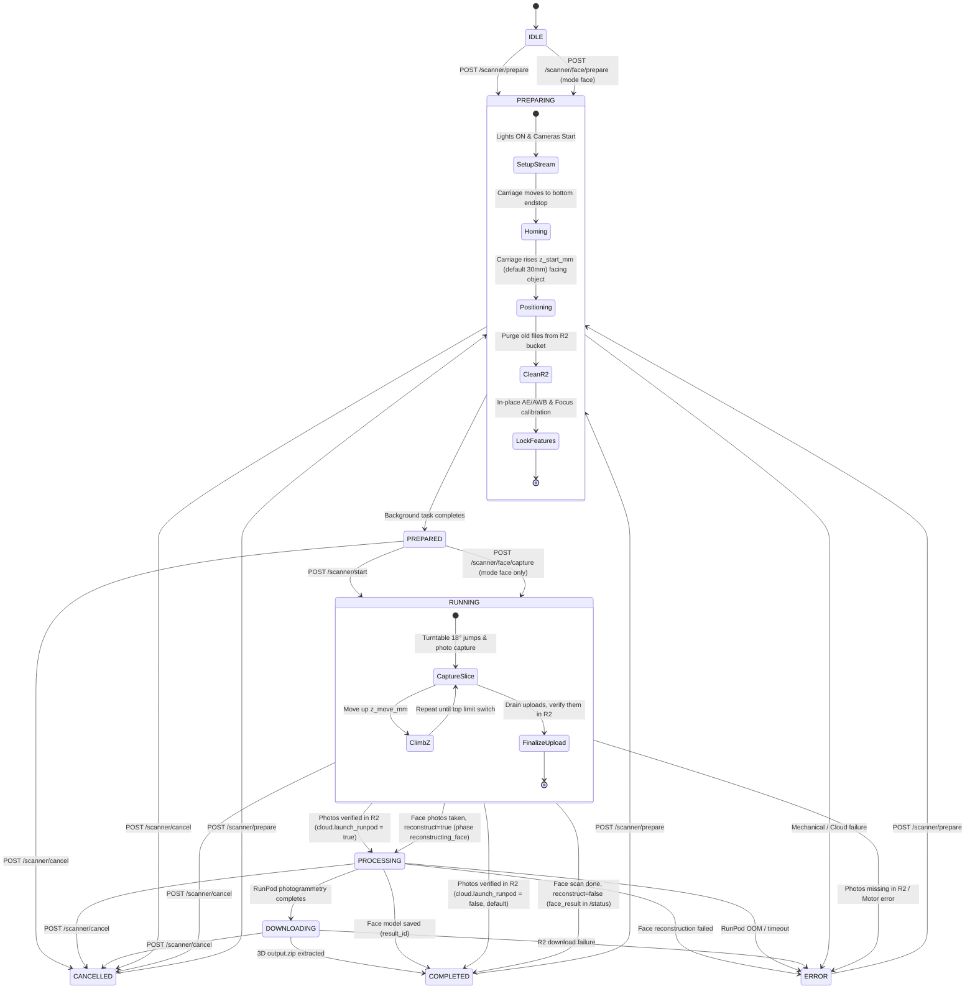

# Scanner Core API Documentation (`/scanner`)

The Scanner router (`../scanner.py`) orchestrates the end-to-end photogrammetry capture: camera stream initialization, mechanical positioning, 360° capture synchronization, photo upload to Cloudflare R2 with verification, the face scan, and (optionally, per request, off by default) the legacy cloud reconstruction on RunPod.

> **3D reconstruction.** Object scans are reconstructed by **Turntable Studio** on RunPod (`cloud/`, taken from `../template_meshroom/turntable_studio/cloud/`): every scan uploads its photos to R2 under its own prefix `jobs/<job_id>/input/rig/0|1/*.jpg` while it runs, and with `cloud.launch_runpod: true` one pod is started automatically after the verification; its `output.zip` is extracted into `results/<job_id>/` (served by `/library`) and `jobs/<job_id>/` is deleted from R2. Face scans are reconstructed **on the Pi** (`rpi_face_mesh/`, FACE-20). Check the cloud configuration without starting a pod with `POST /test/cloud/runpod-dry-run` (`TEST_API.md`).

> **Without the Arduino** every request that moves a motor (`/prepare`, `/start`, `/face/prepare`, `/face/capture`, the `/test` motor endpoints) answers **503** with a message naming the Arduino; the rest of the server works. The Arduino is checked (and reconnected) at every such request, so plugging it back in is enough.

Interactive OpenAPI documentation is accessible at: `http://127.0.0.1:8000/docs#/Scanner`

> **Local access only.** The server listens on `127.0.0.1`: the API and the web page are reachable from the Raspberry Pi itself, not from the network (see the README for the launch commands). Every example uses `http://127.0.0.1:8000`.

---

## State Machine Architecture

The scanner operates as a strictly validated finite state machine (`ScannerState`):


```mermaid
stateDiagram-v2
    [*] --> IDLE
    IDLE --> PREPARING: POST /scanner/prepare
    COMPLETED --> PREPARING: POST /scanner/prepare
    CANCELLED --> PREPARING: POST /scanner/prepare
    ERROR --> PREPARING: POST /scanner/prepare

    state PREPARING {
        [*] --> SetupStream: Lights ON & Cameras Start
        SetupStream --> Homing: Carriage moves to bottom endstop
        Homing --> Positioning: Carriage rises z_start_mm (default 30mm) facing object
        Positioning --> CleanR2: Purge old files from R2 bucket
        CleanR2 --> LockFeatures: In-place AE/AWB & Focus calibration
        LockFeatures --> [*]
    }

    PREPARING --> PREPARED: Background task completes
    PREPARED --> RUNNING: POST /scanner/start

    state RUNNING {
        [*] --> CaptureSlice: Turntable 18° jumps & photo capture
        CaptureSlice --> ClimbZ: Move up z_move_mm
        ClimbZ --> CaptureSlice: Repeat until top limit switch
        CaptureSlice --> FinalizeUpload: Drain uploads, verify them in R2
        FinalizeUpload --> [*]
    }

    RUNNING --> COMPLETED: Photos verified in R2 (cloud.launch_runpod = false, default)
    RUNNING --> PROCESSING: Photos verified in R2 (cloud.launch_runpod = true)
    PROCESSING --> DOWNLOADING: RunPod photogrammetry completes
    DOWNLOADING --> COMPLETED: 3D output.zip extracted

    IDLE --> PREPARING: POST /scanner/face/prepare (mode face)
    PREPARED --> RUNNING: POST /scanner/face/capture (mode face only)
    RUNNING --> COMPLETED: Face scan done, reconstruct=false (face_result in /status)
    RUNNING --> PROCESSING: Face photos taken, reconstruct=true (phase reconstructing_face)
    PROCESSING --> COMPLETED: Face model saved (result_id)
    PROCESSING --> ERROR: Face reconstruction failed

    PREPARING --> CANCELLED: POST /scanner/cancel
    PREPARED --> CANCELLED: POST /scanner/cancel
    RUNNING --> CANCELLED: POST /scanner/cancel
    PROCESSING --> CANCELLED: POST /scanner/cancel
    DOWNLOADING --> CANCELLED: POST /scanner/cancel

    PREPARING --> ERROR: Mechanical / Cloud failure
    RUNNING --> ERROR: Photos missing in R2 / Motor error
    PROCESSING --> ERROR: RunPod OOM / timeout
    DOWNLOADING --> ERROR: R2 download failure
```

---

## Endpoint Reference

| Method | Path | Status Code | Description |
|---|---|---|---|
| `POST` | `/scanner/prepare` | `202 Accepted` | Starts live stream immediately, homes carriage, and auto-tunes cameras in background |
| `POST` | `/scanner/start` | `202 Accepted` | Launches the physical scan and the verified upload to R2; the RunPod pipeline only when `cloud.launch_runpod` is `true` |
| `POST` | `/scanner/face/prepare` | `202 Accepted` | Prepares a face scan (mode `face`): lights, stream, homing and climb to `start_z_mm`; poll `/status` until `prepared` |
| `POST` | `/scanner/face/capture` | `202 Accepted` | After the face prepare: finds the height, locks the cameras on the face, takes the stereo pair, verified upload; poll `/status` until `completed` |
| `POST` | `/scanner/cancel` | `200 OK` | Emergency stop: cuts motor power, kills lights, closes streams, terminates cloud pods |
| `GET` | `/scanner/status` | `200 OK` | Polls current state, phase, photo counters (captured / uploaded / missing), failure reason, and active stream URLs |
| `GET` | `/scanner/stream/mjpeg` | `200 OK` | Direct multipart MJPEG stream for browser `` tags (`?camera=1\|2`) with on-demand encoding |
| `POST` | `/scanner/stream/active` | `200 OK` | Instantaneous zero-latency active preview camera switch (`?camera_id=1\|2`) |
| `POST` | `/scanner/stream/quality` | `200 OK` | Dynamically updates live stream JPEG compression quality (`1..100`, default 80) |
| `GET` | `/scanner/stream/sync-status` | `200 OK` | Returns real-time libcamera `rpi.sync` status, frame rates, and offset telemetry |

---

## 1. Prepare Scan (`POST /scanner/prepare`)

Prepares the scanner for framing and calibration. 

### Behavior
1. **Immediate Execution (~1.5s)**:
   - Validates that state is in `[IDLE, COMPLETED, CANCELLED, ERROR]`.
   - Transitions state to `PREPARING`.
   - Powers ON the chamber lights.
   - Runs the preflight (Cloudflare R2 read/write/delete, ToF sensor, free disk space); a failure is a `400` and nothing is touched.
   - Initializes the dual cameras and starts the MJPEG live preview (there is no video encoder and no bitrate).
   - **Immediately returns HTTP 202** with the MJPEG preview URLs (`/scanner/stream/mjpeg?camera=1|2`), usable directly as ``.
2. **Background Execution**:
   - Drives the carriage down until the bottom limit switch triggers (`home_z_axis`).
   - Climbs `z_start_mm` (default **30mm**) above home to rest directly in front of the illuminated turntable object (`0` skips the climb).
   - Cleans up old assets in the Cloudflare R2 bucket.
   - Re-runs camera auto-tuning (`prepare_scan`) in position: settles auto-exposure and auto-white-balance on the illuminated object, then locks them.
   - Transitions state to `PREPARED`.

### Request Body (`PrepareRequest`)
Every field is optional. A client may send only the basic fields (photo quality / resolution) and leave the advanced ones out: whatever is missing takes the default declared in the schema (`camera_config` itself may be omitted too). A front-end that prefers to send all values may send the defaults below.
```json
{
  "enable_stream": true,
  "illumination_brightness": 1.0,
  "z_start_mm": 30.0,
  "camera_config": {
    "quality": 95,
    "photo_resolution": [4056, 3040],
    "focus": "auto",
    "copy_colour_gains": false
  }
}
```

| Field | Default | Rules |
|---|---|---|
| `enable_stream` | `true` | Start the MJPEG live preview. |
| `illumination_brightness` | `1.0` | **LED** brightness (PWM), `0 < v <= 1` (0 is refused). Not the image brightness below. |
| `z_delay` | `0.0010` | Step delay (s) of the climb to the start height, `0.0001..0.05`. |
| `z_start_mm` | `30.0` | Scan start height above the bottom endstop in mm, `0 <= v <= 100`, a whole number of motor steps (multiples of `0.01`; otherwise 422). `0` stays on the endstop. Not part of `camera_config`. |
| `camera_config.quality` | `95` | JPEG quality of the photos, 10-100. |
| `camera_config.photo_resolution` | `[4056, 3040]` | `[width, height]`: exactly `[4056, 3040]` (full sensor) or `[2028, 1520]` (2x2 binned, same field of view); any other value is a 422. |
| `camera_config.focus` | `"auto"` | `"auto"`: sharpness sweep on the lit object, best position per lens, locked for the scan. An integer: both lenses at that position (a value below 0 becomes 0, above 1023 becomes 1023). `[cam1, cam2]`: exactly two integers, clamped the same way (another length is a 422). `null` (or `[null, null]`): the last focus positions saved on the Pi. |
| `camera_config.preview_resolution` | `[960, 720]` | Live preview size, even numbers, not larger than the photo. |
| `camera_config.rotation` | `0` | `0/90/180/270`, or a `[cam1, cam2]` pair. |
| `camera_config.settle_time` | `2.0` | Seconds AE/AWB settle before they are locked. |
| `camera_config.exposure_time`, `analogue_gain`, `colour_gains`, `awb_mode` | `null`, `null`, `null`, `"auto"` | Manual exposure (µs, `> 0`), gain (`1-16`), `[red, blue]` white-balance gains. Left out = automatic, then locked for the whole scan. |
| `camera_config.copy_colour_gains` | `false` | When AE/AWB are locked, `false`: each camera keeps the white-balance gains of its own AWB (exposure time and gain are still copied from camera 1). `true`: camera 1's gains are copied to camera 2, which gives it a colour cast when the sensors differ. Default `rpi_sync` mode only. |
| `camera_config.brightness`, `contrast`, `saturation`, `sharpness` | `null` | **Image** adjustments. |
| `camera_config.master_id`, `slave_id` | `0`, `1` | Camera ids. |

Unknown keys inside `camera_config` are ignored (older clients keep working).

### Response (`202 Accepted` - `PrepareResponse`)
```json
{
  "status": "accepted",
  "message": "Live stream started. Rig homing and camera tuning in progress.",
  "state": "preparing",
  "stream_urls": [
    "/scanner/stream/mjpeg?camera=1",
    "/scanner/stream/mjpeg?camera=2"
  ]
}
```

### Error Responses
* `400 Bad Request`: If scanner is currently in an invalid state (e.g. `RUNNING` or `PROCESSING`), or the scanner refuses to prepare with a message (preflight refusal). The state is checked **before** anything is touched, so a refused `/prepare` does not change the LED brightness.
* `409 Conflict`: A temporary refusal: an emergency stop is still tearing the previous run down, or another motion (manual `/test` move, homing) is in progress. Retry shortly.
* `503 Service Unavailable`: the Arduino (motor controller) does not answer; nothing was touched.
* `400 Bad Request` also when the ToF sensor is missing or gives no valid reading after one reinitialisation (`ToFSensor.reinitialize()`).
* `422 Unprocessable Entity`: Invalid body, e.g. `illumination_brightness` is `0` (the range is `0 < b <= 1.0`: the scanner cannot scan in the dark) or a request key is unknown.
* `500 Internal Server Error`: Hardware initialization failure.

### Example `curl`
```bash
curl -X POST http://127.0.0.1:8000/scanner/prepare \
     -H "Content-Type: application/json" \
     -d '{
       "enable_stream": true,
       "illumination_brightness": 1.0,
       "camera_config": {
         "master_id": 0,
         "slave_id": 1
       }
     }'
```

---

## 2. Start Scan (`POST /scanner/start`)

Starts the automated scanning workflow: physical scan, photo upload to R2 and verification of the uploaded set. The cloud 3D generation (RunPod) is **optional** and off by default (`cloud.launch_runpod`).

### Pre-conditions
* Scanner state **must** be `PREPARED` with `mode: "object"` (obtained by polling `GET /scanner/status` after calling `/prepare`). After a `/scanner/face/prepare` it answers `400`.

### Behavior
1. Validates `scanner.state == ScannerState.PREPARED`.
2. Returns HTTP `202 Accepted` immediately.
3. Dispatches the multi-stage background orchestrator:
   * **Stage 1 (Physical Scan & Upload - `RUNNING`)**:
     * Rotates turntable in incremental jumps (`angle`, default `18.0°` = 20 stops per 360° ring) using smooth trapezoidal velocity ramping (default 20% ramp) to eliminate inertia slip.
     * Synchronously captures photos from both cameras (2 photos per stop).
     * Pushes captured images into a background upload queue (uploads stream to Cloudflare R2 in parallel).
     * Climbs Z-axis by `z_move_mm` (default `100.0mm`) per elevation ring until the top limit switch triggers.
     * An upload worker retries failed uploads with backoff (one attempt of one file lasts at most 5 minutes); when the scan ends it waits for the uploads to drain (**5 minutes without a single success** is the limit) and the bucket is verified against the manifest.
     * When the scan ends, the uploads are verified against the list of expected keys in the R2 bucket. Missing photos end the run in `error` (see below) and stay on disk.
   * **Stage 1b (Completion without RunPod - `COMPLETED`)** (`cloud.launch_runpod = false`, tests only; the default is `true`):
     * The state becomes `COMPLETED` as soon as the photos are verified in R2. `cloud.runpod` is not imported or called, so a missing RunPod key or package does not matter. Download the photos from the bucket for the reconstruction (Turntable Studio).
   * **Stage 2 (Turntable Studio on RunPod - `PROCESSING`)** (only when `cloud.launch_runpod = true`, no confirmation asked):
     * `cloud.job.run_cloud_job(skip_upload=True)`: R2 preflight, plan of the pod (photo count and size -> RAM estimate `cloud/resources.py` x 1.3, vCPU, disk), termination of every `turntable-*` pod left by an older job, then one pod (`gpuTypePriority: "custom"`, GPU list `RUNPOD_GPU_TYPES`) with temporary R2 credentials limited to `jobs/<job_id>/` (read-only `input/`, read-write `output/`) that expire with the pod's runtime cap (`RUNPOD_POD_MAX_RUNTIME_S`, 1 h).
     * Completion is read from `jobs/<job_id>/output/status.json`. Every pod is terminated in a `finally` (success, failure, timeout, cancel); at most `RUNPOD_MAX_POD_ATTEMPTS` (2) pods per job. `phase_message` shows the progress lines.
     * `output.zip` is downloaded and extracted into `results/<job_id>/`, then `jobs/<job_id>/` is deleted from R2. On a failure the photos stay in R2 (retry) and the pod's `run_log.txt` is saved in `results/<job_id>/`.
   * **Stage 3 (Completion - `COMPLETED`)**: `result_id` in `/status` is the `/library` id of the model (= `job_id`). A failed job ends in `error` with `error` set.

> A `CANCELLED` state is never overwritten: a cancel that arrives while the pipeline is finishing keeps the run `cancelled`.

### Request Body (`StartRequest`)
```json
{
  "job_id": null,
  "mechanical": {
    "turntable": {
      "angle": 18.0,
      "delay": 0.0010,
      "acceleration": true,
      "ramp_percent": 0.2,
      "decel_percent": null,
      "start_delay": null,
      "end_delay": 0.015
    },
    "z_axis": {
      "distance_mm": 100.0,
      "delay": 0.0010,
      "acceleration": false,
      "ramp_percent": 0.2,
      "decel_percent": null,
      "start_delay": null,
      "end_delay": null
    }
  },
  "cloud": {
    "launch_runpod": true,
    "resolution_level": 1,
    "title": null
  }
}
```

#### Mechanical & Motor Configuration Parameters

> A scan always rotates the platter in one fixed direction and only climbs, so the request has no `turntable.clockwise` and no `z_axis.direction`. A client that still sends them is not rejected: the fields are ignored. The manual test endpoints (`/test/turntable/rotate`, `/test/motor/z-move`) keep `clockwise` and `direction`.

| Field | Type | Default | Description |
|---|---|---|---|
| `turntable.angle` | `float` | `18.0` | Turntable rotation angle per slice in degrees. At most `180`, a whole number of microsteps (multiples of `0.1125°`) **and** it must divide a full revolution in whole steps (`3200 % steps == 0`, e.g. `18`, `22.5`, `11.25`; `33.75` is rejected) so a ring of photos closes exactly at 360°. |
| `z_axis.distance_mm` | `float` | `100.0` | Vertical travel distance in millimeters between rotational slices (`> 0`, at most `475`, the Z travel). |
| `turntable.delay` | `float` | `0.0010` | Cruise pulse delay in seconds (target maximum angular speed), range `0.0001`–`0.05`. Recommended for scans: `>= 0.0005`. |
| `turntable.acceleration` | `bool` | `true` | Enables trapezoidal velocity ramping to prevent heavy object slippage. |
| `turntable.ramp_percent` | `float` | `0.2` | Fraction of total steps for acceleration ramp (`0.0` to `1.0`). |
| `turntable.decel_percent` | `float \| null` | `null` | Separate deceleration fraction. If `null`, mirrors `ramp_percent`. |
| `turntable.start_delay` | `float \| null` | `null` | Initial launch delay in seconds, range `0.0001`–`0.05`. Defaults to `3 * delay` (light objects) or `5x–8x` for heavy items. |
| `turntable.end_delay` | `float \| null` | `0.015` | Step delay in seconds at the end of each deceleration (slow stop), range `0.005`–`0.030`; `null` disables it. Out-of-range values are rejected (`422`). |
| `z_axis.delay` | `float` | `0.0010` | Cruise pulse delay in seconds for vertical lead screw elevator, range `0.0001`–`0.05`. |
| `z_axis.acceleration` | `bool` | `false` | Disabled by default on Z-axis to prevent lead screw shuddering. |
| `z_axis.ramp_percent` | `float` | `0.2` | Fraction of steps for acceleration if `z_axis.acceleration` is enabled. |
| `z_axis.decel_percent` | `float \| null` | `null` | Optional separate deceleration fraction for Z-axis. |
| `z_axis.start_delay` | `float \| null` | `null` | Starting launch delay for Z-axis if acceleration is enabled, range `0.0001`–`0.05`. |
| `z_axis.end_delay` | `float \| null` | `null` | Optional slow-stop step delay for the Z-axis, range `0.005`–`0.030`; `null` (default) disables it. |
| `job_id` | `string \| null` | `null` | Id of the job: R2 prefix `jobs/<job_id>/` and folder `results/<job_id>/`. Format `YYYYMMDD-HHMMSS-xxxxxx` (the `/library` id, else 422); `null` = a new one (shown in `/status`). |
| `cloud.launch_runpod` | `bool` | `true` | `true` (default): Turntable Studio on RunPod after the scan (object scans are always reconstructed in the cloud). `false` (tests only): the scan stops (`completed`) once the photos are verified in R2. `true`: a Turntable Studio pod starts automatically afterwards. With `true`, `/start` answers `400` when `RUNPOD_API_KEY`, `TURNTABLE_IMAGE`, `CLOUDFLARE_ACCOUNT_ID`, `CLOUDFLARE_R2_API_TOKEN` or the `R2_*` keys are missing. |
| `cloud.resolution_level` | `int` | `1` | Turntable Studio dense level `0..3` (each level halves both photo sides; also sizes the pod RAM). |
| `cloud.title` | `string \| null` | `null` | Name written to `object.json` by the pod (max 120 characters). |

> **Unknown keys are rejected (`422`).** `StartRequest`, `mechanical`, `turntable`, `z_axis` and `cloud` use `extra="forbid"`: a misspelled or misplaced key (e.g. `mechanical.angle` instead of `mechanical.turntable.angle`) no longer silently falls back to the default. Only the legacy `turntable.clockwise` and `z_axis.direction` are still accepted (and ignored). The `camera_config` block of `/prepare` still tolerates extra keys.

### Response (`202 Accepted` - `StartResponse`)
```json
{
  "status": "accepted",
  "message": "Pipeline started."
}
```

### Error Responses
* `400 Bad Request`: If scanner state is not `PREPARED`, the scanner was prepared for a face scan (`mode: "face"`), `cloud.launch_runpod` is `true` and RunPod is not configured (`RUNPOD_API_KEY` missing, placeholder image name), or the ToF sensor is missing / gives no valid reading after one reinitialisation (it ends the scan at the top of the object). Refused before the physical scan starts.
* `503 Service Unavailable`: the Arduino does not answer (the USB link may have dropped since `/prepare`).
* `422 Unprocessable Entity`: an unknown key anywhere in the body (e.g. `mechanical.angle`, `mechanical.z_move_mm`); `cloud.resolution_mp` is `0` or above `13.0`; `turntable.angle` is not a whole number of microsteps (multiples of `0.1125°` at 1/16), is above `180`, or does not divide a full revolution in whole steps (`3200 % steps != 0`, e.g. `33.75` or `360`); `z_axis.distance_mm` is above `475` or not a whole number of steps (multiples of `0.01 mm` at 1/4); `delay` / `start_delay` is outside `0.0001`–`0.05` s. Validated up front, so a bad value no longer fails the scan after `prepare`. (The manual `POST /test/turntable/rotate` still accepts up to `360°`, see `TEST_API.md`.)
* `409 Conflict`: A previous `POST /scanner/start` was already accepted and its pipeline has not finished yet (prevents two simultaneous scans from a double click).
  ```json
  {"detail": "Cannot start scan from state idle. Must be PREPARED."}
  ```

### Example `curl`
```bash
curl -X POST http://127.0.0.1:8000/scanner/start \
     -H "Content-Type: application/json" \
     -d '{
       "job_id": "scan-sample-01",
       "mechanical": {
         "turntable": {
           "angle": 18.0,
           "delay": 0.0010,
           "acceleration": true,
           "ramp_percent": 0.4,
           "decel_percent": 0.6,
           "start_delay": 0.0060
         },
         "z_axis": {
           "distance_mm": 50.0,
           "delay": 0.0010,
           "acceleration": false
         }
       },
       "cloud": {
         "launch_runpod": false
       }
     }'
```

---

## 3. Cancel / Emergency Stop (`POST /scanner/cancel`)

Instantly aborts all physical movements and cloud computing.

### Behavior
1. **Physical E-Stop**: Cuts motor power & torque on both the turntable and Z-axis steppers (`release_torque=True`).
2. **Lights & Cameras**: Powers off illumination LEDs and closes camera streams.
3. **Upload Abort**: Immediately cancels the background photo upload worker.
4. **Cloud Pod Termination**: If a RunPod job is active, immediately terminates the remote GPU pod to stop billing.
5. **State Transition**: Sets `scanner.state = CANCELLED`.

### Response (`200 OK` - `CancelResponse`)
```json
{
  "status": "success",
  "state": "cancelled"
}
```

### Example `curl`
```bash
curl -X POST http://127.0.0.1:8000/scanner/cancel
```

---

## 4. Get Status (`GET /scanner/status`)

Polling endpoint used by the frontend to track the active state, the phase, photo counters, the failure reason, and the MJPEG preview links.

### Recommended Polling Interval
* **During Preparation / Running / Processing**: Poll every **1.0 to 2.0 seconds**.
* **During Idle**: Stop polling or poll every 10 seconds.

### Response (`200 OK` - `StatusResponse`)
```json
{
  "state": "running",
  "mode": "object",
  "total_photos": 40,
  "stream_urls": [
    "/scanner/stream/mjpeg?camera=1",
    "/scanner/stream/mjpeg?camera=2"
  ],
  "phase": "scanning",
  "phase_message": "Ring 2: capturing",
  "level": 2,
  "photos_captured": 24,
  "photos_uploaded": 22,
  "missing": [],
  "error": null,
  "tof_warnings": [],
  "face_result": null,
  "seconds_since_last_upload": 3.2,
  "upload_drain_timeout_s": 300.0
}
```

| Field | Type | Description |
|---|---|---|
| `state` | `string` | State machine state (table below). |
| `mode` | `string \| null` | What the last prepare readied the rig for: `object` (`/scanner/prepare`), `face` (`/scanner/face/prepare`), `null` (none, or a manual `/test` session). Stays set after the run. |
| `total_photos` | `int` | Photos captured so far (kept for backward compatibility). |
| `phase` | `string \| null` | Finer progress inside a state, e.g. `preparing`, `scanning`, `uploading`, `verifying`, `done`. `null` when the scanner does not report it. |
| `phase_message` | `string \| null` | Human readable detail of the phase. |
| `level` | `int` | Current ring (`0` = first). |
| `photos_captured` | `int` | Photos taken by the cameras. |
| `photos_uploaded` | `int` | Photos confirmed uploaded to R2. |
| `missing` | `string[]` | R2 keys not found at the final verification (at most 50 are returned). Non-empty only with `state: "error"`. |
| `error` | `string \| null` | Why the run ended in `error`. |
| `tof_warnings` | `string[]` | Time-of-flight sensor warnings (e.g. invalid readings) raised during the scan. |
| `face_result` | `object \| null` | Set when a face scan completed: `optimal_z_mm`, `best_score` (`null` without a search or when no face was found), `face_detected` (`null` without a search, `false` = no face found, the photo was taken at the start height), `warning`, `photos` (paths on the Pi), `r2_uploaded`, `result_id` / `metrics` / `reconstruction_error` (local 3D model). Reset by the next prepare or face scan. |
| `job_id` | `string \| null` | Id of the current photo set: R2 prefix `jobs/<job_id>/`. |
| `result_id` | `string \| null` | `/library` id of the 3D model saved by the last run (cloud object scan or face scan); `null` until one is saved. |
| `seconds_since_last_upload` | `float \| null` | Seconds since the last successful upload to R2 (or since the upload or the drain started, whichever is later). `null` when no upload is running. |
| `upload_drain_timeout_s` | `float \| null` | After the physical scan, the run ends in `error` when no upload succeeds for this long (300 s). With the field above a client can show "no upload progress for 2 min of 5". |

All new fields have safe defaults (`null`, `0`, `[]`), so a client written for the old response keeps working.

### Error mapping
When `scan()` finishes the physical scan but the verification finds photos missing from the bucket, the pipeline ends in `state: "error"` with `missing` and `error` filled (the photos stay on disk). Any other failure ends in `error` too, except a cancel: `cancelled` is never overwritten.

### State Meaning Table
| `state` | Description | Typical Duration |
|---|---|---|
| `idle` | Scanner is powered on and waiting for commands | Indefinite |
| `preparing` | Cameras streaming, carriage homing, cloud sanitizing | 15–30 seconds |
| `prepared` | Carriage in position, AE/AWB locked, ready to scan | Until `/start` |
| `running` | Turntable rotating, taking photos, uploading to R2; or a face capture in progress | 2–5 minutes (face capture: under a minute plus the upload) |
| `processing` | Finalising after the scan: Turntable Studio on RunPod (`cloud.launch_runpod = true`) or the 3D face model on the Pi (phase `reconstructing_face`) | seconds; 10–20 s for a face, up to the pod cap (60 min) with RunPod |
| `downloading` | Downloading completed 3D model from R2 (RunPod only) | 10–30 seconds |
| `completed` | Photos verified in R2 (default), a face scan done (`face_result`), or, with RunPod, 3D model ready in output folder | Finished |
| `cancelled` | Aborted by user via `/cancel` | Finished |
| `error` | Hardware, upload verification (`missing` photos) or cloud failure occurred; see `error` | Finished |

### Example `curl`
```bash
curl -X GET http://127.0.0.1:8000/scanner/status
```

---

## 5. Native MJPEG Video Stream (`GET /scanner/stream/mjpeg`)

Delivers a high-framerate `multipart/x-mixed-replace` MJPEG stream directly consumable by HTML `` elements in web browsers without requiring RTSP plugins, WebRTC transcoders, or HLS latency.

### Query Parameters
* `camera` (optional `int`, values `1` or `2`): Selects which camera sensor to stream from. If omitted, streams from the currently active camera (`cam1` by default).

### Behavior & Resource Optimization
1. **On-Demand Encoding (Spectator Tracking)**:
   - When a browser connects to the endpoint, the server registers the connection via `dual_cameras.add_spectator(cam_idx)`.
   - The camera grab loop only encodes frames into JPEG when `spectator_count > 0`. When no browsers are viewing, CPU encoding overhead is **0%**.
   - Upon connection closure or network teardown, the `finally` block unregisters via `remove_spectator(cam_idx)`.
2. **Decoupled Stream Quality**:
   - Compresses frames using `dual_cameras.stream_quality` (default: 80).
   - Keeps high-resolution photogrammetry captures completely isolated at full 95% quality.
3. **Multi-Client Concurrency**:
   - Supports multiple concurrent viewers on the same camera or different cameras simultaneously.
   - Each client independently pulls new frames via `wait_jpeg()` without duplicate camera grabs.

### Response (`200 OK`)
* **Headers**: `Content-Type: multipart/x-mixed-replace; boundary=FRAME`
* **Payload**: Continuous stream of JPEG frames wrapped in multipart boundaries.

### Example Usage (HTML)
```html
<!-- Live preview of Camera 1 -->


<!-- Live preview of Camera 2 -->

```

### Example `curl`
```bash
curl -N http://127.0.0.1:8000/scanner/stream/mjpeg?camera=1 > /dev/null
```

---

## 6. Active Preview Camera Switch (`POST /scanner/stream/active`)

Instantly toggles the active preview camera between Camera 1 (upper) and Camera 2 (lower).

### Query Parameters
* `camera_id` (required `int`, `1` or `2`): Target camera ID.

### Behavior
* **Zero Loading Latency**:
  - In `DualCameraRPISync` mode, both cameras continuously grab frames into DMA triple buffers (`buffer_count=3`).
  - Switching `active_camera` updates an internal index pointer. If the user changes views or toggles preview links, the video switches **immediately** with zero reconnect loading delay.

### Response (`200 OK`)
```json
{
  "status": "success",
  "active_camera": 2,
  "message": "Switched preview to camera 2."
}
```

### Example `curl`
```bash
curl -X POST "http://127.0.0.1:8000/scanner/stream/active?camera_id=2"
```

---

## 7. Dynamic Stream Quality Control (`POST /scanner/stream/quality`)

Dynamically adjusts the live preview JPEG compression quality on the fly without stopping the stream or dropping frames.

### Query Parameters
* `quality` (required `int`, `1` to `100`): Target JPEG compression quality. Defaults to 80.

### Behavior
* In `DualCameraRPISync`, updates the live `stream_quality` property.
* **Non-Destructive**: Photogrammetry still image quality (`quality=95`) is completely protected and remains unaffected.
* Provides instant bandwidth adaptation for low-signal Wi-Fi setups.

### Response (`200 OK`)
```json
{
  "status": "success",
  "quality": 75,
  "message": "Updated stream quality to 75."
}
```

### Example `curl`
```bash
curl -X POST "http://127.0.0.1:8000/scanner/stream/quality?quality=75"
```

---

## 8. Frame Synchronization Status (`GET /scanner/stream/sync-status`)

Returns real-time telemetry from the dual camera driver: `rpi.sync` readiness, the newest frame of each camera, dropped frames, the sub-frame shutter offset and what each sensor is using. (Also available as `GET /test/stream/sync-status`: the same function.)

### Response (`200 OK`)
```json
{
  "ready": true,
  "cam1_ready": true,
  "cam2_ready": true,
  "cam1_seq": 1420,
  "cam2_seq": 1420,
  "active_camera": 1,
  "offset_ms": 0.028,
  "drops": [0, 0],
  "stream_fps": 10.0,
  "last_jpeg_kb": 85.0,
  "quality": 95,
  "stream_quality": 80,
  "spectators": [1, 0],
  "cam1_controls": {"exposure_time": 10000, "analogue_gain": 1.5, "colour_gains": [1.8, 1.6], "sensor_timestamp": 123456789},
  "cam2_controls": {"exposure_time": 10000, "analogue_gain": 1.5, "colour_gains": [2.0, 1.5], "sensor_timestamp": 123456812}
}
```
Drivers without a continuous sync pipeline (`xvs`, `staggered`) answer only `{"ready": true, "is_streaming": <bool>, "mode": "<driver class>"}`.

### Telemetry Field Guide (`DualCameraRPISync`)
* `ready`: `true` when both cameras reported `SyncReady` (`cam1_ready`, `cam2_ready` per camera).
* `cam1_seq`, `cam2_seq`: sequence number of the newest frame of each camera.
* `active_camera`: the camera of the live preview (1 or 2).
* `offset_ms`: shutter phase difference between the two cameras, modulo the frame period (100 ms at the default 10 fps). Measured on the rig at about 0.037 ms; `null` until both cameras have delivered a frame.
* `drops`: frames dropped, per camera `[cam1, cam2]`.
* `stream_fps`: JPEG frames per second published to the browsers over the last 2 s (0 when nobody watches; the preview encodes only while a viewer is connected).
* `last_jpeg_kb`: size of the last preview JPEG. `quality` / `stream_quality`: JPEG quality of the photos / of the preview.
* `spectators`: connected viewers `[cam1, cam2]`.
* `cam1_controls`, `cam2_controls`: what each sensor is really using now (`exposure_time` in microseconds, `analogue_gain`, `colour_gains`, `sensor_timestamp`); a black picture shows up here as a tiny exposure.

### Example `curl`
```bash
curl -X GET http://127.0.0.1:8000/scanner/stream/sync-status
```

---

## 9. Face Scan (`POST /scanner/face/prepare`, then `POST /scanner/face/capture`)

A face scan has the same two steps as an object scan: a **prepare** that readies the rig and waits with the live stream on, then a **capture** sent by the front-end when the subject is in place. Both answer `202` at once; poll `GET /scanner/status`. `POST /scanner/cancel` stops either step.

### 9.1 Prepare (`POST /scanner/face/prepare`, body `FacePrepareRequest`)

```json
{
  "enable_stream": true,
  "illumination_brightness": 0.5,
  "start_z_mm": 180.0,
  "upload_r2": true,
  "camera_config": {"focus": "auto"}
}
```

| Field | Default | Description |
|---|---|---|
| `enable_stream` | `true` | Start the MJPEG preview. |
| `illumination_brightness` | `0.5` | LED brightness, `0 < b <= 1` (50 % not to blind the subject). |
| `start_z_mm` | `180.0` | Where the carriage waits and the search starts, `100..350` mm, whole Z steps. |
| `upload_r2` | `false` | Faces stay on the Pi (reconstructed locally); `true` also uploads the pair to R2. |
| `z_delay` | `0.005` | Step delay (s) of every Z move of the face scan (2 mm/s, so the lenses are not shaken, FACE-19), `0.0001..0.05`. Kept for the capture. |
| `upload_r2` | `true` | Upload and verify the photo pair; the bucket is cleaned by this prepare. |
| `camera_config` | defaults of `DualCameraConfig` | As for `/scanner/prepare`. `focus: "auto"`: the lenses stay on the saved position during the search and an autofocus sweep runs **on the face** at the height found. An integer or a pair: that position, no autofocus. `exposure_time` / `analogue_gain` / `colour_gains`: used for the photo; otherwise AE/AWB settle on the face and are locked before it. |

What it does: checks that MediaPipe, OpenCV and the face model are there (`400` otherwise: nothing has moved), the preflight (Arduino, cloud only with `upload_r2`, disk space; **not** the ToF sensor), lights and cameras, then in the background: homing, climb to `start_z_mm`, light stabilisation, the cameras left **unlocked** (AE/AWB follow the subject). The state becomes `prepared` with `mode: "face"`. Errors: like `/scanner/prepare` (`400`, `409`, `422`, `503`).

### 9.2 Capture (`POST /scanner/face/capture`, body `FaceCaptureRequest`)

```json
{
  "strategy": "sweep_best_score",
  "search_range_mm": 150.0,
  "step_mm": 8.0,
  "manual_z": null,
  "settle_s": 0.150
}
```

| Field | Default | Description |
|---|---|---|
| `strategy` | `"sweep_best_score"` | `sweep_best_score`: climbs through the range and returns to the best height; `direct_stop`: stops as soon as both cameras see the face vertically centred; `none`: photo at the prepared height, no search. |
| `search_range_mm` | `150.0` | How far above the prepared height the search goes (`10..250`); prepared height + range must stay `<= 475` mm (`422`). |
| `step_mm` | `8.0` | Climb between two evaluations (`1..25`). |
| `manual_z` | `null` | Explicit height (`200..475` mm); skips the search. |
| `settle_s` | `0.150` | Pause before the photo (`0.05..2`). |
| `z_delay` | `null` | Step delay (s) of this capture's Z moves; `null` keeps the prepare's `z_delay`. |
| `reconstruct` | `true` | Build the 3D face model on the Pi after the photo (`rpi_face_mesh`); `false` = photos only. |

Every distance must be a whole number of Z steps (multiples of `0.01 mm`). Unknown keys are refused (`422`), including `home`, `start_z_mm`, `upload_r2` and `illumination_brightness` (they belong to the prepare; the carriage is always homed by the prepare).

Workflow (background, `Scanner.face_scan`):
1. **Height**: `manual_z`, the search (MediaPipe FaceLandmarker on **fresh** preview frames: a frame exposed during the move is never used; no fresh frame in 3 s is an `error`), or none. Every Z move at constant speed (`acceleration=False`), arriving from below (anti-backlash). Only the endstop in the direction of the move counts; at the top switch the search ends with an `error` (the position is no longer known).
2. **No face**: not an error. The photo is taken at the start height and `face_result` has `face_detected: false`, `best_score: null` and a `warning` (also in `phase_message`). The score of a height adds the centering, the size, the cheek profile and the share of the face landmarks inside the frame.
3. **Camera lock on the face**: autofocus sweep on the face box of each camera (with `focus: "auto"`), then AE/AWB settle and lock; the subject should hold still for about 10 s.
4. **Capture**: after `settle_s`, the synchronized pair `input_images/rig/0/f_{Z}.jpg` and `input_images/rig/1/f_{Z}.jpg`; with the prepare's `upload_r2`, uploaded and verified like the object scan.
5. **Teardown**: motors released, lights off, cameras closed.
6. **3D model on the Pi** (`reconstruct: true`): the state becomes `processing` (the rig is already released), `phase` is `reconstructing_face` and `phase_message` follows the steps ("Detecting face landmarks...", "Computing 3D geometry & depth...", "Baking texture...", "Exporting models (GLB, STL, OBJ)..."). The model (`obj/`, `glb/`, `stl/`, `3mf/`, `object.json` with the size in mm and the IPD) is saved in `results/<job_id>/` and listed by `/library`; `face_result.result_id` and `result_id` give its id, `face_result.metrics` the size. A failed reconstruction ends the run in `error` (`error` says why, `face_result.reconstruction_error` too; the photos are kept in `face_result.photos`). A cancel kills it (`cancelled`). Timeout `FACE_RECONSTRUCT_TIMEOUT_S` (300 s).
7. The state becomes `completed` with `face_result`. Another capture needs another face prepare.

Errors before the `202`: `400` the scanner is not `prepared` with `mode: "face"` (call `/scanner/face/prepare`), or MediaPipe is missing for a search; `409` another run or an emergency stop; `422` invalid body or a search beyond the travel; `503` the Arduino does not answer.

### Result (in `GET /scanner/status` once `completed`)

```json
{
  "state": "completed",
  "mode": "face",
  "phase": "done",
  "face_result": {
    "optimal_z_mm": 240.0,
    "best_score": 1.85,
    "face_detected": true,
    "warning": null,
    "photos": ["<project>/input_images/rig/0/f_240.jpg", "<project>/input_images/rig/1/f_240.jpg"],
    "r2_uploaded": true
  }
}
```

### Example `curl`

```bash
curl -X POST http://127.0.0.1:8000/scanner/face/prepare -H "Content-Type: application/json" -d '{"start_z_mm": 180.0}'
curl http://127.0.0.1:8000/scanner/status          # until "state": "prepared", "mode": "face"
curl -X POST http://127.0.0.1:8000/scanner/face/capture -H "Content-Type: application/json" \
     -d '{"strategy": "sweep_best_score"}'
curl http://127.0.0.1:8000/scanner/status          # until "completed"; the result is in face_result
```

---

## Frontend Integration Pattern (JavaScript / TypeScript)

```typescript
// 1. Prepare Scanner and Display Live MJPEG Stream
async function prepareScanner() {
  const res = await fetch("http://127.0.0.1:8000/scanner/prepare", {
    method: "POST",
    headers: { "Content-Type": "application/json" },
    body: JSON.stringify({
      enable_stream: true,
      camera_config: {
        quality: 95,
        photo_resolution: [4056, 3040]
      }
    })
  });
  const data = await res.json();
  
  // Option A: Point an  tag directly to the native low-latency MJPEG stream
  const imgElement = document.getElementById("live-stream") as HTMLImageElement;
  imgElement.src = "http://127.0.0.1:8000/scanner/stream/mjpeg?camera=1";

  // Option B: use the URLs returned by the server (the same MJPEG endpoints)
  if (data.stream_urls) {
    console.log("Preview URLs:", data.stream_urls);
  }

  // Poll until scanner reaches PREPARED state
  await pollUntilState("prepared");
}

// 2. Switch Camera View in UI with Zero Latency
async function switchCamera(cameraId: 1 | 2) {
  // Option A: Call the switch API to flip the default stream
  await fetch(`http://127.0.0.1:8000/scanner/stream/active?camera_id=${cameraId}`, { method: "POST" });
  
  // Option B: Or simply update the  src query parameter directly!
  const imgElement = document.getElementById("live-stream") as HTMLImageElement;
  imgElement.src = `http://127.0.0.1:8000/scanner/stream/mjpeg?camera=${cameraId}`;
}

// 3. Start the Photogrammetry Scan
async function startScan(jobId: string) {
  await fetch("http://127.0.0.1:8000/scanner/start", {
    method: "POST",
    headers: { "Content-Type": "application/json" },
    body: JSON.stringify({
      job_id: jobId,
      mechanical: {
        turntable: {
          angle: 18.0,
          delay: 0.0010,
          acceleration: true,
          ramp_percent: 0.2
        },
        z_axis: {
          distance_mm: 80.0,
          delay: 0.0010,
          acceleration: false
        }
      },
      cloud: { launch_runpod: false, mode: "rig", depthmap_downscale: 2 }
    })
  });

  // Track progress through completion
  await pollUntilState("completed");
}

// 4. Face scan: prepare (wait with the stream on), then capture when the subject is in place
async function faceScan() {
  const post = (url, body) => fetch(url, {
    method: "POST", headers: { "Content-Type": "application/json" }, body: JSON.stringify(body)
  });
  let res = await post("http://127.0.0.1:8000/scanner/face/prepare", { start_z_mm: 180.0 });
  if (res.status !== 202) throw new Error((await res.json()).detail);
  await pollUntilState("prepared");                 // mode === "face"
  res = await post("http://127.0.0.1:8000/scanner/face/capture", { strategy: "sweep_best_score" });
  if (res.status !== 202) throw new Error((await res.json()).detail);  // 400 not prepared, 409 busy, 422 invalid
  const status = await pollUntilState("completed");
  return status.face_result;  // { optimal_z_mm, best_score, face_detected, warning, photos, r2_uploaded }
}

// 5. Polling helper
async function pollUntilState(targetState: string) {
  while (true) {
    const res = await fetch("http://127.0.0.1:8000/scanner/status");
    const status = await res.json();
    
    console.log(`Current state: ${status.state} (${status.phase ?? "-"}), photos: ${status.photos_uploaded}/${status.photos_captured}`);

    if (status.state === targetState) return status;
    if (status.state === "error" || status.state === "cancelled") {
      const why = status.error ?? `${status.missing.length} photo(s) missing`;
      throw new Error(`Scan ended with state: ${status.state} (${why})`);
    }
    
    await new Promise(r => setTimeout(r, 1500));
  }
}
```
